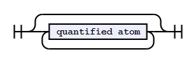
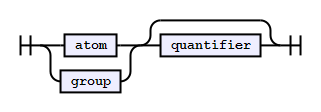
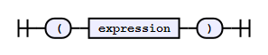
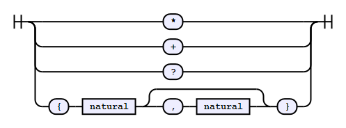
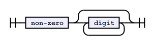
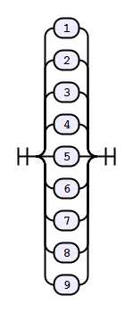
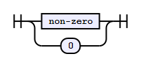

# RegArray

A finite state machine that verifies that the elements of an array match
a regular pattern, defined in a DSL similar to regular expressions.

## API

### Constructor: `RegArray(expression [, validators])`

We use a syntax similar to JavaScript's native `RegExp` object, for the
sake of consistency. It expects one or two arguments:

#### `expression`

The `expression` is a string that defines how an array's elements must
be patterned. It consists of a sequence of, potentially quantified,
elements that correspond to an array's index. A formal specification of
the language can be found in the [Grammar](#grammar) section, but
broadly:

##### Validators

The atomic units of an expression, which are ultimately used to validate
array elements, are the identifiers of validator functions. Their naming
follows the same standard as JavaScript identifiers (excluding Unicode):

* Case-sensitive;
* Must start with a (Latin) letter, `$` or `_`;
* Can be followed by any number of word (`/\w/`) characters.

##### Groups

Expressions can be nested, collected together and quantified within
parentheses.

##### Alternations

Expressions can be grouped into a disjunction to allow for alternations
for any index validation, rather than having to write more complex
validator functions. This is done by interposing expressions (simple or
complex) with `|` characters.

##### Quantifiers

Expressions can be defined to occur a specific number of times by
suffixing any of the following:

 Quantifier | The preceding expression...
 ---------- | ---------------------
 `{n}`      | ...must appear exactly `n` times. By default, if a quantifier is omitted, the engine assumes `{1}`.
 `{n,m}`    | ...must appear between `n` and `m` times (inclusive). Note that `m` must be greater than `n`.
 `?`        | ...is optional. This is the same as `{0,1}`.
 `+`        | ...must appear at least once.
 `*`        | ...may appear any number of times (including none at all).

##### Anchors

By default, the engine will start checking from the first (0th) index of
an array. If you wish to anchor your expression about then `n`th index,
you can start with `@n`.

##### Comments

Comments can be included in the expression by preceding them with `#`.
They are then defined up until the next `\n`.

##### Example

If the following validators are defined, with obvious meanings:

* `integer`
* `string`
* `datetime`

...then this expression:

```
@1 integer+ # Number(s) from [1]
string{2} (string datetime?)*
```

...would evaluate the following array structures as:

 Index | Valid   | Valid        | Invalid
 :---: | ------- | ------------ | -------
 0     | `null`  | `[1, 2]`     | `1`
 1     | `5`     | `1`          | `2`
 2     | `9`     | `'Hello'`    | `false`
 3     | `'foo'` | `'World'`    |
 4     | `'bar'` | `'boop'`     |
 5     |         | `'doot'`     |
 6     |         | `1981-09-25` |

#### `validators`

The `validators` parameter is optional and is used to specify element
validator functions. It should be a plain object with members having
identifiers matching those referenced in `expression`.

If the parameter is omitted, then the engine will only have access to
its internal (i.e., [predefined](#internal-validators)) validators. You
*may* override these, but that would be bad practice. A better solution
would be to alias the internal validators to your own identifiers.

For example:

```js
{
  id:      RegArray.integer,
  period:  RegArray.datetime,
  truthy:  function(data) {
             return data ? true : false;
           }
}
```

It is not necessary to specify all validators if some of them are basic
enough to fall back to the internal set:

```js
var x = new RegArray('integer+ flag', {
                                        flag: function(data) {
                                                return (data === 'COMPLETE');
                                              }
                                      });
```

Note that validator functions needn't return a `Boolean`. The FSM will
pass an element if the validator function returns any truthy value.

### Internal Validators

The following validators are available. These may be named explicitly in
the `expression`, or can be aliased to other names by referencing.

#### `RegArray.numeric`

Checks whether the array element is numeric. Note that a numeric
datatype isn't required (e.g., `'12.3e10'` will evaluate to true).

#### `RegArray.integer`

Similar to the above, but stricter insofar as it will only validate
integers.

#### `RegArray.datetime`

Checks whether the array element is a date and/or time. `Date` values
are vacuously valid; other values will be parsed using `Date.parse`
(i.e., RFC2822 or ISO 8601 format).

### Object Methods

#### `test(array)`

Checks if `array` conforms to `expression`, using the appropriate
validator functions, returning a `Boolean`.

#### `toString()`

Returns `expression`, defined in the constructor.

## Grammar

The EBNF for the language is as follows:

```ebnf
expression      = {quantified atom};
quantified atom = (atom | group), [quantifier];
group           = '(', expression, ')';
atom            = 'list' | 'of' | 'symbols';
quantifier      = '*' | '+' | '?' | '{', natural, [',', natural], '}';
natural         = non-zero, {digit};
non-zero        = '1' | '2' | '3' | '4' | '5' | '6' | '7' | '8' | '9';
digit           = non-zero | '0';
```

### `expression`


### `quantified atom`


### `group`


### `atom`


### `quantifier`


### `natural`


### `non-zero`


### `digit`


*Diagrams created using [tabatkins/railroad-diagrams](https://github.com/tabatkins/railroad-diagrams)*
